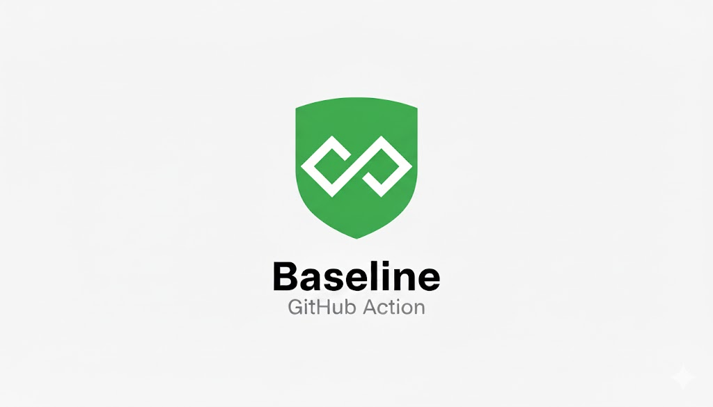

<div align="center">
  
</div>

# Baseline GitHub Action

Automatically enforce web platform feature compatibility standards in your CI/CD pipeline. Unlike existing linting tools that provide suggestions, Baseline acts as a compliance gatekeeper, preventing non-compliant code from reaching production environments.

> 🚀 **Demo Update**: Enhanced with mapping coverage intelligence and comprehensive scan metrics!

## Features

- 🆕 **Official Baseline Queries**: First GitHub Action to support the new web.dev Baseline syntax (`baseline 2022`, `baseline widely available`)
- 🔍 **Comprehensive Feature Detection**: Analyzes CSS, JavaScript, and HTML files for web platform features
- 🧩 **Framework Support**: Native support for React (.jsx/.tsx), Vue (.vue), Svelte (.svelte), and TypeScript
- 📊 **Baseline Status Resolution**: Queries web-features data to determine compatibility status  
- 🛡️ **Intelligent Policy Enforcement**: Auto-configures enforcement from official Baseline queries with 4 enforcement modes
- 📄 **Detailed Reporting**: Generates violation reports with remediation guidance
- 🔗 **GitHub Integration**: Provides status checks, PR comments, and workflow controls
- ⚡ **Performance Optimized**: Caches Baseline data and analyzes only changed files
- 🛠️ **Highly Configurable**: Supports browserslist integration and custom rules

## Quick Start

### Basic Usage

```yaml
# .github/workflows/baseline-check.yml
name: Baseline Compliance Check

on:
  pull_request:
    paths:
      - '**/*.{js,jsx,ts,tsx,css,scss,html}'

jobs:
  baseline-check:
    runs-on: ubuntu-latest
    steps:
      - uses: actions/checkout@v4
      
      - name: Check Baseline Compliance
        uses: Aristide021/baseline@v1.0.0
        with:
          baseline-threshold: 'newly'
          enforcement-mode: 'error'
          comment-on-pr: true
          github-token: ${{ secrets.GITHUB_TOKEN }}
```

### Advanced Configuration

```yaml
# .github/workflows/baseline-advanced.yml
name: Advanced Baseline Enforcement

on:
  pull_request:
  push:
    branches: [main, develop]

jobs:
  baseline-enforcement:
    runs-on: ubuntu-latest
    
    steps:
      - uses: actions/checkout@v4
        with:
          fetch-depth: 0  # For diff analysis
      
      - name: Cache Baseline Data
        uses: actions/cache@v4
        with:
          path: .baseline-cache
          key: baseline-${{ hashFiles('.baseline.json') }}
      
      - name: Baseline Check
        uses: Aristide021/baseline@v1.0.0
        with:
          baseline-threshold: 'newly'
          fail-on-new-only: true
          max-violations: 5
          config-path: '.baseline.json'
          
      - name: Upload Report
        uses: actions/upload-artifact@v4
        if: always()
        with:
          name: baseline-report
          path: baseline-report.md
```

## Official Baseline Queries Support 🆕

**First GitHub Action to support the new official Baseline syntax!**

Building on the emerging Browserslist Baseline query support, this action automatically detects and intelligently configures enforcement based on these official queries.

### Supported Queries

```
# .browserslistrc
baseline widely available     # 30+ months interoperable
baseline newly available      # ≤30 months interoperable  
baseline 2022                # Features from 2022 and older
baseline widely available on 2024-06-06  # Specific date
```

### Auto-Configuration

| Query Type | Enforcement Mode | Effect |
|------------|------------------|--------|
| `baseline 2022` | `yearly` | Age-based rules: 3+ years=error, 2+ years=warn |
| `baseline widely available` | `per-feature` | Strict threshold=widely |
| `baseline newly available` | `per-feature` | Balanced threshold=newly |

### Example Usage

```yaml
# .browserslistrc
baseline 2022

# No additional configuration needed!
# Action auto-configures yearly enforcement
```

**Result:** Features from 2022+ are enforced based on age, with 2022 features marked as errors and newer features as warnings or info.

[📚 Full Official Baseline Queries Documentation](./examples/official-baseline-queries.md)

## 🎯 Try the Interactive Demo

Experience the action with our comprehensive demo setup:

### [👉 View Demo Branch](https://github.com/Aristide021/baseline/tree/demo)

**See the dual scenario demonstration:**
- 🚨 **Strict Enforcement**: Shows violation detection with risky CSS features  
- ✅ **Passing Compliance**: Demonstrates clean success with baseline-safe code
- 📊 **SARIF integration** with GitHub Advanced Security
- 🔍 **86.3% mapping coverage** with alias resolution and synthetic features

### Example Workflows

Ready-to-use workflow examples are in the [`examples/`](./examples/) directory:
- **[`baseline-demo-workflow.yml`](./examples/baseline-demo-workflow.yml)**: Complete dual scenario demonstration
- **[`basic-workflow.yml`](./examples/basic-workflow.yml)**: Simple getting started workflow  
- **[`advanced-workflow.yml`](./examples/advanced-workflow.yml)**: Full-featured enterprise setup

## SARIF Support for GitHub Advanced Security 🛡️

Generate SARIF output for integration with GitHub Advanced Security code scanning:

### Basic SARIF Usage

```yaml
- name: Run Baseline Check
  uses: Aristide021/baseline@v1.0.0
  with:
    github-token: ${{ secrets.GITHUB_TOKEN }}
    sarif-output: 'baseline-results.sarif'

- name: Upload SARIF to GitHub Security
  uses: github/codeql-action/upload-sarif@v3
  if: always()
  with:
    sarif_file: 'baseline-results.sarif'
```

### Advanced SARIF Configuration

```yaml
- name: Run Baseline Check with SARIF
  uses: Aristide021/baseline@v1.0.0
  with:
    github-token: ${{ secrets.GITHUB_TOKEN }}
    output-format: 'sarif'           # Primary output as SARIF
    sarif-output: 'security/baseline.sarif'  # Additional SARIF for security tab

- name: Upload to Security Tab
  uses: github/codeql-action/upload-sarif@v3
  if: always()
  with:
    sarif_file: 'security/baseline.sarif'
    category: 'baseline-compatibility'
```

**Benefits:**
- 🔍 **Unified Security View** - See Baseline issues alongside other security findings
- 📊 **Trend Analysis** - Track compatibility improvements over time  
- 🎯 **Integrated Workflow** - Works with GitHub's native security features
- 📈 **Compliance Reporting** - Generate security compliance reports

## Configuration

### Input Parameters

| Input | Description | Default |
|-------|-------------|---------|
| `baseline-threshold` | Minimum Baseline status required (`limited`\|`newly`\|`widely`) | `newly` |
| `include-patterns` | File patterns to analyze | `**/*.{js,jsx,ts,tsx,css,scss,html}` |
| `exclude-patterns` | File patterns to ignore | `node_modules/**,dist/**,build/**` |
| `scan-mode` | Scan scope: `auto` (changed files, fallback all) \| `diff` (only changed) \| `repo` (entire repository) | `auto` |
| `enforcement-mode` | Enforcement level (`warn`\|`error`\|`block`) | `error` |
| `max-violations` | Maximum violations before failing | `0` |
| `comment-on-pr` | Post detailed PR comments | `true` |
| `fail-on-new-only` | Only fail on newly introduced violations | `false` |
| `config-path` | Path to configuration file | `.baseline.json` |
| `output-format` | Output format (`json`\|`markdown`\|`sarif`) | `json` |
| `sarif-output` | Path to write SARIF output for GitHub Advanced Security | _(none)_ |

### Configuration File

Create a `.baseline.json` file in your repository root:

```json
{
  "rules": {
    "css": {
      "baseline-threshold": "newly",
      "allowed-exceptions": [
        {
          "feature": "css-container-queries",
          "reason": "Progressive enhancement with fallback",
          "files": ["src/components/modern/**"]
        }
      ]
    },
    "javascript": {
      "baseline-threshold": "newly",
      "strict-mode": true
    },
    "html": {
      "baseline-threshold": "newly",
      "ignore-attributes": ["data-*"]
    }
  },
  "enforcement": {
    "max-violations": 0,
    "fail-on-new-only": false
  },
  "reporting": {
    "include-remediation": true,
    "group-by-feature": true,
    "show-polyfill-suggestions": true
  }
}
```

## Supported Features

### CSS Features
- Grid and Flexbox layouts
- Custom Properties (CSS Variables)
- Container Queries
- Cascade Layers
- Color functions (color-mix, light-dark)
- Modern selectors (:has, :is, :where)
- And many more...

### JavaScript Features  
- Fetch API
- Web APIs (IntersectionObserver, ResizeObserver, etc.)
- Modern syntax (async/await, optional chaining, etc.)
- Web Components
- Service Workers
- And many more...

### HTML Features
- Modern input types
- Semantic elements
- Form validation attributes
- Progressive web app features
- And many more...

## Outputs

| Output | Description |
|--------|-------------|
| `violations-count` | Number of compliance violations found |
| `compliance-score` | Percentage of features meeting baseline requirements |
| `report-path` | Path to the generated report file |

### Adaptive Yearly Enforcement (Automatic)

When a Browserslist Baseline year query (e.g. `baseline 2022`) is detected, the action synthesizes year-based rules:

| Age (years) | Generated Level | Rationale |
|-------------|-----------------|-----------|
| >= 3 | error | Feature considered mature — deviations are high risk |
| >= 2 | warn  | Transition period — surface but don’t block |
| >= 1 | info  | Emerging stability — informational only |
| < 1 | off   | Too new for enforcement |

Pseudo-algorithm:
```
for each detectedYear:
  age = currentYear - detectedYear
  if age >= 3: rule[year] = 'error'
  else if age >= 2: rule[year] = 'warn'
  else if age >= 1: rule[year] = 'info'
  else: rule[year] = 'off'
augment older missing years as 'error'
extend forward years as 'off' / 'info'
```

These rules combine with per-feature Baseline status checks to form a hybrid adaptive policy without manual configuration.

### Deterministic Exit Codes

Baseline sets predictable exit codes for CI scripting:

| Code | Meaning | Condition |
|------|---------|-----------|
| 0 | Success | No violations exceeding thresholds |
| 1 | Violations | At least one violation (no high severity) and enforcement triggered |
| 2 | High severity violations | One or more high severity violations present |

> Note: High severity is determined by policy engine classification (e.g., older year / stricter threshold breaches). Code `2` is preserved by avoiding `core.setFailed` so downstream composite actions can branch on it.

## Example Reports

When violations are found, the action generates detailed reports:

### PR Comment


### Detailed Report
```markdown
## ❌ Baseline Compliance Check

Found **3** features that don't meet your Baseline threshold.

### Summary
| Metric | Value |
|--------|-------|
| Total Violations | 3 |
| Compliance Score | 85% |
| High Severity | 1 🚨 |
| Medium Severity | 2 ⚠️ |

### Violations by File

#### `src/components/Modal.css`
- **Line 15**: CSS Container Queries 🚨
  - Current: 🔴 Limited
  - Required: 🟡 Newly Interoperable
  - Remediation: Use media queries as fallback

#### `src/utils/api.js`  
- **Line 23**: Fetch API ⚠️
  - Current: 🟡 Newly Interoperable
  - Required: 🟢 Widely Available
  - Remediation: Use polyfill or XMLHttpRequest fallback
```

## Remediation Guidance

The action provides specific remediation suggestions:

- **Polyfill recommendations** with package names
- **Alternative feature suggestions** for better compatibility
- **Progressive enhancement patterns** with code examples
- **Feature detection** snippets
- **Documentation links** to MDN and specifications

## Performance

- **Incremental Analysis**: Only analyzes changed files in PRs
- **Intelligent Caching**: Caches Baseline data for 24 hours
- **Parallel Processing**: Analyzes multiple files concurrently
- **Efficient Parsing**: Uses optimized parsers for each file type

## Project Sustainability

This project is designed for long-term maintainability and reliability with comprehensive automation:

- **🔄 Automated Quality Assurance**: CI pipeline validates all 282 feature mappings on every commit
- **🤖 Enhanced Discovery Engine**: AI-powered system automatically suggests new feature mappings (486 found!)
- **📦 Dependency Management**: Dependabot automatically manages security updates and compatibility  
- **📊 Performance Monitoring**: Multi-Node.js version testing ensures broad compatibility
- **📋 Maintenance Strategy**: Detailed sustainability plan with quarterly review cycles

For complete maintenance procedures, see [MAINTENANCE.md](MAINTENANCE.md).

### Quality Metrics
- **Test Coverage**: 98.8% (84/85 tests passing)
- **Mapping Accuracy**: 100% validation against web-features database
- **Feature Coverage**: 282 validated mappings (161 CSS, 49 JS, 72 HTML)
- **CI Success Rate**: >99% across all supported Node.js versions

## Contributing

We welcome contributions! Please see our [Contributing Guide](CONTRIBUTING.md) for details.

## License

MIT License - see [LICENSE](LICENSE) file for details.

# Trigger dual demo workflow
# Trigger comprehensive dual scenario test
